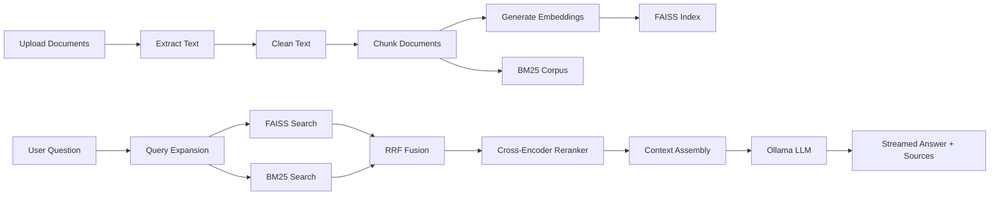

# RAG Question-Answering System

A local-first Retrieval-Augmented Generation (RAG) application for asking questions over uploaded documents.

The system lets users create notebooks, upload study resources, index them locally, and ask questions with source-backed answers. It runs with a local Ollama model, so document content does not need to be sent to any cloud API.

## Key Features

- Multi-notebook workspace with separate indexes per notebook.
- PDF, DOCX, and TXT document ingestion.
- Text cleaning and sentence-aware chunking with overlap.
- Local embeddings using `all-MiniLM-L6-v2`.
- FAISS vector search for semantic retrieval.
- BM25 keyword search for exact-term matching.
- Hybrid retrieval with Reciprocal Rank Fusion (RRF).
- Query expansion for short or ambiguous questions.
- Cross-encoder reranking with `BAAI/bge-reranker-base`.
- Local answer generation with Ollama using `mistral`.
- Standard and map-reduce answer modes.
- Streaming responses using Server-Sent Events (SSE).
- Conversation history and notebook memory.
- Source citations with chunk previews.
- Feedback buttons for generated answers.
- Upload, retry, and delete source workflows.
- SQLite persistence with schema migrations.
- React frontend with dark mode, search, export, and responsive layout.
- Pytest test suite and retrieval benchmark scripts.

## Architecture



## Tech Stack

| Layer | Technology |
| --- | --- |
| Frontend | React 18, Vite, React Router |
| Backend | FastAPI, SQLite |
| LLM | Ollama `mistral` |
| Embeddings | `all-MiniLM-L6-v2` |
| Vector Search | FAISS |
| Keyword Search | rank-bm25 |
| Reranking | `BAAI/bge-reranker-base` |
| Document Parsing | PyMuPDF, python-docx |
| Streaming | Server-Sent Events |
| Testing | pytest |

## Project Structure

```text
.
|-- api/
|   |-- server.py          # FastAPI routes and streaming answer endpoint
|   `-- database.py        # SQLite persistence helpers
|-- src/
|   |-- document_loader.py # PDF, DOCX, TXT text extraction
|   |-- text_cleaner.py    # Extracted text cleanup
|   |-- chunker.py         # Sentence-aware chunking
|   |-- embedding_model.py # SentenceTransformer embeddings
|   |-- vector_store.py    # FAISS index creation and loading
|   |-- bm25_retriever.py  # BM25 sparse retrieval
|   |-- retriever.py       # Hybrid retrieval logic
|   |-- reranker.py        # Cross-encoder reranking
|   |-- rag_engine.py      # RAG prompt and answer orchestration
|   |-- map_reduce_engine.py
|   `-- query_expander.py
|-- frontend/
|   `-- src/               # React pages, components, and API client
|-- migrations/            # SQLite schema migrations
|-- tests/                 # Unit tests
|-- evaluation/            # Benchmark scripts and test questions
|-- config.py              # Central project configuration
|-- main.py                # CLI pipeline entry point
|-- requirements.txt       # Python dependencies
`-- README.md
```

## Prerequisites

- Python 3.10+
- Node.js 18+
- Git
- Ollama installed and running

Install Ollama from:

```text
https://ollama.com
```

Pull the configured local model:

```bash
ollama pull mistral
```

## Setup

Clone the repository:

```bash
git clone <your-repo-url>
cd Question-Answering-System-using-RAG-main
```

Create and activate a Python virtual environment:

```bash
python -m venv venv
```

On Windows:

```bash
venv\Scripts\activate
```

On macOS/Linux:

```bash
source venv/bin/activate
```

Install backend dependencies:

```bash
pip install -r requirements.txt
```

Install frontend dependencies:

```bash
cd frontend
npm install
cd ..
```

## Running The App

Start the backend:

```bash
uvicorn api.server:app --reload --port 8000
```

Start the frontend in a second terminal:

```bash
cd frontend
npm run dev
```

Open the app:

```text
http://localhost:5173
```

## Typical Workflow

1. Create a notebook.
2. Upload PDF, DOCX, or TXT sources.
3. Wait until indexing finishes.
4. Select the sources you want to ask from.
5. Ask a question in the chat.
6. Review the streamed answer and cited source chunks.
7. Use feedback, export, or conversation history as needed.

## CLI Usage

The project also includes a command-line pipeline through `main.py`.

| Command | Description |
| --- | --- |
| `python main.py` | Run document processing and embedding pipeline. |
| `python main.py --phase 1` | Extract, clean, and chunk documents. |
| `python main.py --phase 2` | Build FAISS and BM25 indexes from chunks. |
| `python main.py --query "your question"` | Run retrieval only, without LLM generation. |
| `python main.py --ask "your question"` | Run full RAG answer generation. |
| `python main.py --ask "your question" --mode mapreduce` | Use map-reduce answer mode. |

Useful flags:

| Flag | Description |
| --- | --- |
| `--top-k K` | Number of final chunks to use. |
| `--model MODEL` | Ollama model tag to use. |
| `--mode standard` | Single-pass answer mode. |
| `--mode mapreduce` | Multi-step answer synthesis mode. |

## Configuration

Main settings live in `config.py`.

| Setting | Current Value | Purpose |
| --- | --- | --- |
| `OLLAMA_MODEL` | `mistral` | Local LLM used for generation. |
| `EMBEDDING_MODEL` | `all-MiniLM-L6-v2` | Embedding model for chunks and queries. |
| `CHUNK_SIZE` | `600` | Target words per chunk. |
| `CHUNK_OVERLAP` | `75` | Word overlap between chunks. |
| `TOP_K` | `5` | Default number of retrieved chunks. |
| `RETRIEVAL_POOL` | `20` | Candidate pool before reranking. |
| `RERANK_TOP_N` | `5` | Final chunks after reranking. |
| `ENABLE_MULTI_QUERY` | `True` | Enables query expansion. |
| `ENABLE_HYBRID_SEARCH` | `True` | Enables FAISS + BM25 retrieval. |
| `CONTEXT_CAP` | `3000` | Maximum context words sent to the LLM. |
| `DB_PATH` | `notebooks.db` | SQLite database path. |

## API Endpoints

| Method | Endpoint | Description |
| --- | --- | --- |
| `GET` | `/api/notebooks` | List notebooks with source and conversation counts. |
| `POST` | `/api/notebooks` | Create a notebook. |
| `PATCH` | `/api/notebooks/{nid}` | Rename/update a notebook. |
| `DELETE` | `/api/notebooks/{nid}` | Delete a notebook. |
| `POST` | `/api/notebooks/{nid}/touch` | Mark a notebook as recently opened. |
| `GET` | `/api/notebooks/{nid}/conversations` | List conversations. |
| `POST` | `/api/notebooks/{nid}/conversations` | Create a conversation. |
| `PATCH` | `/api/conversations/{cid}` | Rename a conversation. |
| `DELETE` | `/api/conversations/{cid}` | Delete a conversation. |
| `GET` | `/api/conversations/{cid}/messages` | List messages. |
| `POST` | `/api/messages/{mid}/feedback` | Save answer feedback. |
| `GET` | `/api/conversations/{cid}/feedback` | Get feedback for a conversation. |
| `POST` | `/api/ask` | Stream a RAG answer through SSE. |
| `POST` | `/api/upload` | Upload and index sources. |
| `GET` | `/api/sources/{nid}` | List notebook sources. |
| `DELETE` | `/api/sources/{sid}` | Delete a source and re-index remaining sources. |
| `POST` | `/api/sources/{sid}/retry` | Retry indexing a failed source. |

## Testing

Run the test suite:

```bash
python -m pytest -q
```

The tests cover:

- text cleaning
- chunking behavior
- SQLite database operations
- query expansion fallback behavior

## Evaluation

The `evaluation/` folder contains scripts for comparing retrieval configurations.

Run a benchmark:

```bash
python evaluation/benchmark.py
```

Compare results:

```bash
python evaluation/compare.py
```

The benchmark measures retrieval latency, reranking latency, retrieved chunk count, unique source coverage, and keyword hit rate.

## Current Limitations

- The current LLM setup is text-only. It does not directly understand images, diagrams, arrows, handwriting, or visual layout.
- OCR is not currently implemented.
- Scanned PDFs or image-only notes may not index well unless selectable text is available.
- Legacy `.doc` files are not reliably parsed by the current loader; use `.docx`, `.pdf`, or `.txt`.
- First-time model downloads for embeddings and reranking can take time.

## Notes

This project is designed as a local RAG system for academic document question-answering. It is especially useful for searchable notes, textbooks, PDFs, and typed study resources where answers should be grounded in uploaded sources.
