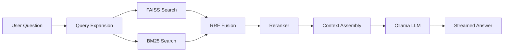

# RAG Question-Answering System
Local-first RAG, no cloud APIs, no data leaves your machine.

## Features
- Multi-notebook organization with per-notebook indexes and metadata.
- PDF, TXT, and DOCX ingestion with per-source status tracking.
- Sentence-aware chunking with overlap for better context.
- Multi-query expansion for short or ambiguous questions.
- Hybrid retrieval (FAISS + BM25) with reciprocal rank fusion.
- Cross-encoder reranking with BAAI/bge-reranker-base.
- Two answer modes: standard and map-reduce.
- Conversation memory window for follow-up questions.
- SSE streaming responses for token-by-token output.
- Markdown rendering with GFM support in chat.
- Source chunk preview and citations.
- Feedback buttons (thumbs up/down) on answers.
- LLM-generated conversation titles.
- Dark mode toggle with persisted theme.
- Loading skeletons during fetch.
- Responsive layout for desktop and mobile.
- Keyboard shortcuts for fast navigation and editing.
- Export conversations to Markdown.
- Delete sources and conversations.
- Retry failed uploads and re-indexing.
- Structured logging for backend pipeline steps.
- Input validation and error handling.
- Rate limiting on the ask endpoint.
- React Router for deep links to notebooks.
- Migration-based SQLite schema management.
- Unit tests with pytest.

## Architecture


## Tech Stack
| Layer | Tech |
| --- | --- |
| LLM | Ollama (`mistral`) |
| Embeddings | all-MiniLM-L6-v2 |
| Re-ranker | BAAI/bge-reranker-base |
| Vector Store | FAISS |
| Keyword Search | rank-bm25 |
| Backend | FastAPI + SQLite |
| Frontend | React 18 + Vite |
| Doc Parsing | PyMuPDF, python-docx |
| Routing | React Router DOM |
| Testing | pytest |

## Prerequisites
- Python 3.10+
- Node.js 18+
- Ollama: https://ollama.com
- Git

## Quick Start
1. Clone the repo and enter it.
   ```bash
   git clone <your-repo-url>
   cd Question-Answering-System-using-RAG-main
   ```
2. Install backend dependencies.
   ```bash
   pip install -r requirements.txt
   ```
3. Install frontend dependencies.
   ```bash
   cd frontend
   npm install
   ```
4. Pull the local LLM.
   ```bash
   ollama pull llama3.2:3b
   ```
5. Start the backend (new terminal).
   ```bash
   uvicorn api.server:app --reload --port 8000
   ```
6. Start the frontend (new terminal) and open the app.
   ```bash
   cd frontend
   npm run dev
   ```
   Open http://localhost:5173

## CLI Usage
| Command/Flag | Phase | Description |
| --- | --- | --- |
| `python main.py` | 1 + 2 | Process documents and build the FAISS index. |
| `python main.py --phase 1` | 1 | PDF/TXT/DOCX to chunks.json. |
| `python main.py --phase 2` | 2 | Chunks to FAISS index and metadata. |
| `python main.py --query "..."` | 3 | Semantic search (no LLM). |
| `python main.py --ask "..."` | 4 | Full RAG answer, standard mode. |
| `python main.py --ask "..." --mode mapreduce` | 5 | Map-reduce answer mode. |
| `--top-k K` | 3-5 | Number of chunks to retrieve. |
| `--model MODEL` | 4-5 | Ollama model tag to use. |

## Configuration
| Variable | Default | Notes |
| --- | --- | --- |
| `BASE_DIR` | project root | Base path for the repo. |
| `DATA_DIR` | `data/` | Raw data root. |
| `PROCESSED_DIR` | `processed/` | Chunk output root. |
| `VECTOR_DIR` | `vector_store/` | FAISS and BM25 storage. |
| `DB_PATH` | `notebooks.db` | SQLite database file. |
| `INPUT_FOLDER` | `data/raw_pdfs/` | CLI input folder. |
| `PDF_DIR` | `data/raw_pdfs/` | Alias for input folder. |
| `CHUNKS_PATH` | `processed/chunks.json` | CLI chunks output. |
| `INDEX_PATH` | `vector_store/faiss_index.bin` | CLI FAISS index. |
| `METADATA_PATH` | `vector_store/metadata.json` | CLI metadata. |
| `CHUNK_SIZE` | `600` | Words per chunk. |
| `CHUNK_OVERLAP` | `75` | Word overlap between chunks. |
| `OVERLAP` | `75` | Alias for overlap. |
| `EMBEDDING_MODEL` | `all-MiniLM-L6-v2` | SentenceTransformer model. |
| `MODEL_NAME` | `all-MiniLM-L6-v2` | Alias for embedding model. |
| `EMBEDDING_DIM` | `384` | Vector dimension. |
| `TOP_K` | `5` | Default retrieval size. |
| `RETRIEVAL_POOL` | `20` | Candidate pool before rerank. |
| `RERANK_TOP_N` | `5` | Final chunks after rerank. |
| `OLLAMA_MODEL` | `llama3.2:3b` | Ollama model tag. |
| `LLM_MODEL` | `llama3.2:3b` | Alias for LLM model. |
| `OLLAMA_HOST` | `http://127.0.0.1:11434` | Local Ollama API endpoint used by the Python client. |
| `OLLAMA_OPTIONS` | `{"num_ctx": 8192, "num_gpu": 17, "num_thread": 8}` | Ollama runtime options tuned for a Quadro M1200-class GPU. |
| `CONTEXT_CAP` | `3000` | Max context words. |
| `MAX_CONTEXT_WORDS` | `3000` | Alias for context cap. |
| `HISTORY_MESSAGES` | `4` | Recent messages kept for memory. |
| `HISTORY_MAX_WORDS` | `500` | Max words for history. |
| `BATCH_SIZE` | `32` | Embedding batch size. |
| `ENABLE_MULTI_QUERY` | `True` | Enable query expansion. |
| `MULTI_QUERY_COUNT` | `3` | Variants per query. |
| `ENABLE_HYBRID_SEARCH` | `True` | Enable FAISS + BM25. |
| `RRF_K` | `60` | Reciprocal rank fusion constant. |
| `BM25_TOP_K_MULTIPLIER` | `2` | BM25 pool multiplier. |
| `IVF_THRESHOLD` | `5000` | Switch to IVF index above this size. |
| `IVF_NLIST` | `100` | IVF nlist. |
| `IVF_NPROBE` | `10` | IVF nprobe. |
| `LOG_FORMAT` | `%(asctime)s [%(levelname)s] %(name)s: %(message)s` | Logging format. |
| `LOG_LEVEL` | `INFO` | Logging level. |

## Project Structure
```
.
├── api/                - FastAPI server and database access
├── src/                - RAG pipeline, retrieval, and LLM orchestration
├── frontend/
│   └── src/            - React UI
├── migrations/         - SQLite schema migrations
├── tests/              - pytest suites
├── evaluation/         - Benchmark scripts and test questions
├── config.py           - Central configuration
├── main.py             - CLI pipeline entry point
└── requirements.txt    - Python dependencies
```

## API Endpoints
| Method | Path | Description |
| --- | --- | --- |
| GET | `/api/notebooks` | List notebooks with counts. |
| POST | `/api/notebooks` | Create a new notebook. |
| PATCH | `/api/notebooks/{nid}` | Rename or update a notebook. |
| DELETE | `/api/notebooks/{nid}` | Delete a notebook. |
| POST | `/api/notebooks/{nid}/touch` | Mark notebook as recently opened. |
| GET | `/api/notebooks/{nid}/conversations` | List conversations for a notebook. |
| POST | `/api/notebooks/{nid}/conversations` | Create a conversation. |
| PATCH | `/api/conversations/{cid}` | Rename a conversation. |
| DELETE | `/api/conversations/{cid}` | Delete a conversation and its messages. |
| GET | `/api/conversations/{cid}/messages` | List messages in a conversation. |
| POST | `/api/messages/{mid}/feedback` | Submit feedback (up/down) for a message. |
| GET | `/api/conversations/{cid}/feedback` | Get feedback map for a conversation. |
| POST | `/api/ask` | Stream an answer via SSE. |
| POST | `/api/upload` | Upload PDF/TXT/DOCX sources. |
| GET | `/api/sources/{nid}` | List sources for a notebook. |
| DELETE | `/api/sources/{sid}` | Delete a source and trigger re-index if needed. |
| POST | `/api/sources/{sid}/retry` | Retry indexing a failed source. |
